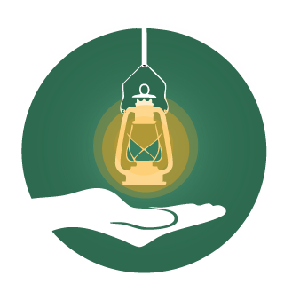

  <h1>Safe Glow</h1>
  
Daniel Erbynn, David Nana Dwomoh Sarpong, Naron Chen, and Siwu Li

  
Project Submission for Philly CodeFest 2025

## Why SafeGlow
Imagine a map that thinks before you walk! 🚀 Our app uses ML-powered A* pathfinding to guide you on the safest route possible—not just the fastest. 

Each intersection is weighted by real-time crime data, severity, and recency, ensuring you avoid risky areas.

🔍 Search your destination, hit “Find Safe Path”, and let the algorithm work its magic. And the best part? Live alerts dynamically re-route you as new data comes in—because safety isn’t static!

This isn’t just a map; it’s your intelligent guardian on the go. 🛡️

## How to use the app

1. The app contains a map with ML weighted nodes at each walkable intersections. The ML model weight the node base on recent crime data, severance of crime, date of crime...etc.

2. User can select/search destination in the app. The implemented A* algorithm will run when user click "find safe path" button. 

3. The route will adjust according to real time alerts! which re-weights the surrounding nodes and forces a reroute calculation!

## Project Demo Url
https://drive.google.com/file/d/1vSDxA0xwRp5sr3qpwHQ7cOybk1vjG2GV/view?usp=sharing

